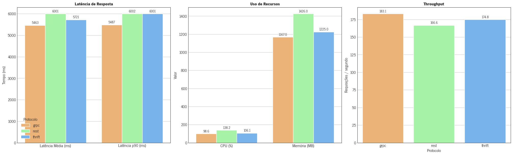

# Orquestração de Microsserviços para Assistentes Financeiros com IA Generativa

**Análise comparativa de protocolos de comunicação entre modelos de IA multimodais**

[](https://creativecommons.org/licenses/by-sa/4.0/)
[](https://www.cesar.school/)
[](https://www.cesar.school/mestrado-profissional-engenharia-de-software/)


## 📥 Download da Dissertação

**📄 [Baixar PDF Completo](cesar_mpes_lssj_orquestramento_microsserviços_assistentes_financeiros.pdf)**

> *Dissertação completa em PDF com todos os capítulos, resultados detalhados, análises estatísticas e referências bibliográficas.*

**Status:** ✅ Aprovado em 11/09/2025

---

## Resumo

Esta dissertação de mestrado investiga a efetividade comparativa das tecnologias de orquestração na implementação de **assistentes financeiros com IA generativa multimodal**, integrando modelos de **Speech-to-Text (STT)**, **Large Language Models (LLM)** e **Text-to-Speech (TTS)**. O estudo compara três protocolos de comunicação entre microsserviços: **REST**, **gRPC** e **Apache Thrift**, avaliando qual é a **melhor forma de fazer esses modelos de IA generativa se comunicarem** em termos de performance e latência.

## Autor

**Luiz Silva dos Santos Júnior**
Mestre em Engenharia de Software
[Centro de Estudos e Sistemas Avançados do Recife - Cesar School](https://www.cesar.school/)

**Orientadora:** Profª. Drª. Pamela Thays Lins Bezerra

## Instituição

**Centro de Estudos e Sistemas Avançados do Recife**
Programa de Pós-Graduação em Engenharia de Software
Mestrado Profissional em Engenharia de Software
Recife, 2025

## Objetivos

### Objetivo Geral
Realizar uma análise comparativa de diferentes tecnologias de orquestração de microsserviços, com foco em performance e latência, para determinar a **melhor forma de fazer modelos de IA generativa se comunicarem** na implementação de assistentes financeiros multimodais que integram **voz, fala e processamento de linguagem natural (LLM)**.

### Objetivos Específicos
1. **Estudo dos pilares teóricos**: Realizar um estudo aprofundado sobre as principais tecnologias de microsserviço e orquestração
2. **Avaliação do estado da arte**: Analisar a literatura técnica e acadêmica sobre análises comparativas entre tecnologias de comunicação
3. **Definir e implementar cenários de teste**: Criar cenários de uso simples, tradicional e complexo para avaliar o comportamento da arquitetura
4. **Avaliar comparativamente os orquestradores**: Utilizar REST, gRPC e Apache Thrift para analisar o desempenho da comunicação entre microsserviços
5. **Analisar a eficiência de recursos computacionais**: Medir a utilização de CPU e memória dos microsserviços em cada cenário

## Estrutura do Projeto

```
📁 mpes-lssj-analise-orquestracao-microsservicos/
├── 📂 src/                          # Código fonte dos experimentos
│   ├── 📂 grpc/                     # Implementação com gRPC
│   │   ├── 📂 k6/                   # Scripts de teste de carga
│   │   ├── 📂 maestro/              # Orquestrador principal
│   │   ├── 📂 mpes-llm/             # Serviço de Large Language Model
│   │   └── 📄 docker-compose.yml    # Configuração de containers
│   ├── 📂 rest/                     # Implementação com REST API
│   │   ├── 📂 k6/                   # Scripts de teste de carga
│   │   ├── 📂 maestro/              # Orquestrador principal
│   │   ├── 📂 mpes-llm/             # Serviço de Large Language Model
│   │   └── 📄 docker-compose.yml    # Configuração de containers
│   └── 📂 thrift/                   # Implementação com Apache Thrift
│       ├── 📂 k6/                   # Scripts de teste de carga
│       ├── 📂 maestro/              # Orquestrador principal
│       ├── 📂 mpes-llm/             # Serviço de Large Language Model
│       └── 📄 docker-compose.yml    # Configuração de containers
├── 📂 reports/                      # Relatórios e análises
│   ├── 📂 dados/                    # Dados coletados dos experimentos
│   │   └── 📄 all_results.csv       # Resultados consolidados
│   ├── 📂 fonts/                    # Fontes para relatórios
│   └── 📄 MPES_Análise_dos_Resultados_e_Geração_de_Gráficos.ipynb
└── 📂 tex/                          # Documentação em LaTeX
    ├── 📂 capitulos/                # Capítulos da dissertação
    ├── 📂 capas/                    # Capas e contracapas
    ├── 📂 preambulo/                # Elementos pré-textuais
    ├── 📂 apêndices/                # Apêndices
    ├── 📂 imagens/                  # Figuras e diagramas
    ├── 📄 mpes-lssj.tex             # Documento principal
    ├── 📄 zotero.bib                # Bibliografia principal
    └── 📄 references.bib            # Referências adicionais
```

## Metodologia

A pesquisa utiliza uma abordagem experimental comparativa, implementando três arquiteturas de microsserviços idênticas que diferem apenas no protocolo de comunicação:

### Tecnologias Avaliadas
- **REST API**: Protocolo baseado em HTTP com JSON
- **gRPC**: Framework de RPC de alta performance do Google
- **Apache Thrift**: Framework de RPC desenvolvido pelo Facebook

### Componentes da Arquitetura de IA Generativa
- **Maestro**: Orquestrador principal que coordena a comunicação entre os modelos de IA
- **STT Service**: Modelo Whisper para Speech-to-Text (conversão de fala para texto)
- **LLM Service**: Modelo Llama3.1 para Large Language Model generativo de texto
- **TTS Service**: Modelo Bark para Text-to-Speech (conversão de texto para fala)

### Métricas Avaliadas
- **Latência**: Tempo de resposta fim-a-fim
- **Throughput**: Número de requisições processadas por segundo
- **Utilização de CPU**: Consumo de processamento
- **Utilização de Memória**: Consumo de memória RAM

## Tecnologias Utilizadas

- **Docker & Docker Compose**: Containerização e orquestração
- **K6**: Ferramenta de teste de carga e performance
- **Python**: Linguagem principal para implementação dos serviços
- **gRPC & Protocol Buffers**: Para implementação gRPC
- **Apache Thrift**: Para implementação Thrift
- **FastAPI/Flask**: Para implementação REST
- **Jupyter Notebook**: Para análise de dados
- **LaTeX**: Para documentação acadêmica

## Como Executar

### Pré-requisitos
- Docker e Docker Compose instalados
- NVIDIA Docker (para suporte a GPU nos modelos de IA)
- Python 3.8+ (para análise de dados)

### Executando os Experimentos

#### 1. REST API
```bash
cd src/rest
docker-compose up -d
```

#### 2. gRPC
```bash
cd src/grpc
docker-compose up -d
```

#### 3. Apache Thrift
```bash
cd src/thrift
docker-compose up -d
```

### Executando Testes de Performance
```bash
# Exemplo para gRPC
# Certifique-se de que os serviços estão rodando
# antes de executar os testes
cd src/grpc/k6
k6 run k6-maestro.js
```
## Resultados

### Principais Achados

Os experimentos foram conduzidos em **três cenários** de complexidade crescente (Simples, Tradicional e Complexo), com **1.000 usuários simultâneos** e **15 amostras por protocolo**, totalizando **135 execuções**. A análise estatística ANOVA confirmou diferenças significativas entre os protocolos (p < 0,001).

#### **Ranking Geral de Performance**
1. **gRPC** - Melhor desempenho em todos os cenários
2. **Apache Thrift** - Performance intermediária
3. **REST** - Menor desempenho, especialmente em cenários complexos

### Comparativo por Cenário

#### **Cenário Simples**
*Consultas diretas e objetivas ao assistente virtual*


| Protocolo | Latência Média (ms) | Throughput (req/s) | CPU (%) | RAM (MB) |
|-----------|--------------------|--------------------|---------|----------|
| **gRPC**  | 280,60            | 3.563,80          | 13,10   | 303      |
| **Thrift** | 345,87 (+23,3%)   | 2.891,20 (-18,9%) | 14,00   | 315      |
| **REST**  | 477,25 (+70,1%)   | 2.095,30 (-41,2%) | 18,10   | 362      |

**Insights**:
- gRPC demonstrou **70% melhor latência** que REST
- Protocolos binários (gRPC/Thrift) são **mais eficientes** em recursos
- REST apresentou maior overhead devido à **serialização JSON**

#### **Cenário Tradicional**
*Consultas de complexidade intermediária com processamento de IA*


| Protocolo | Latência Média (ms) | Throughput (req/s) | CPU (%) | RAM (MB) |
|-----------|--------------------|--------------------|---------|----------|
| **gRPC**  | 2.749,80          | 363,70            | 48,80   | 680      |
| **Thrift** | 2.897,87 (+5,4%)   | 345,10 (-5,1%)    | 52,20   | 711      |
| **REST**  | 3.501,06 (+27,3%)  | 285,60 (-21,5%)   | 69,90   | 846      |

**Insights**:
- Diferenças de performance se **acentuaram** com maior complexidade
- gRPC manteve **maior estabilidade** e previsibilidade
- REST mostrou degradação significativa em **latência de cauda**

#### **Cenário Complexo**
*Processamento intensivo de dados históricos e síntese avançada*



| Protocolo | Latência Média (ms) | Throughput (req/s) | CPU (%) | RAM (MB) |
|-----------|--------------------|--------------------|---------|----------|
| **gRPC**  | 5.462,68          | 183,10            | 98,60   | 1.167    |
| **Thrift** | 5.721,15 (+4,7%)   | 174,80 (-4,5%)    | 106,10  | 1.225    |
| **REST**  | 6.000,97 (+9,9%)   | 166,60 (-9,0%)    | 138,20  | 1.426    |

**Insights**:
- REST atingiu **sistematicamente os limites de timeout**
- gRPC manteve **comportamento mais previsível** mesmo sob alta carga
- **Saturação de recursos** evidenciou limitações dos protocolos menos eficientes

### **Análise Estatística**

A análise ANOVA fatorial confirmou que:
- **Diferenças são estatisticamente significativas** (p < 0,001)
- **Protocolo influencia 23-58%** da variação nas métricas
- **Cenário influencia 91-97%** da variação (complexidade é determinante)

### **Conclusões Práticas**

#### Para o Setor Financeiro:
- **gRPC** oferece **máxima eficiência** para assistentes virtuais multimodais
- **Protocolos binários** reduzem custos operacionais significativamente
- **REST** pode ser limitante em aplicações de IA em tempo real

#### Trade-offs Identificados:
- **Performance vs Simplicidade**: gRPC > Thrift > REST
- **Eficiência de Recursos**: gRPC mais econômico em CPU/memória
- **Previsibilidade**: gRPC mantém latências mais estáveis

### **Dados Completos**

Os resultados detalhados dos experimentos estão disponíveis em:
- **Dados brutos**: `reports/dados/all_results.csv`
- **Análise estatística**: `reports/MPES_Análise_dos_Resultados_e_Geração_de_Gráficos.ipynb`
- **Discussão completa**: Capítulo 5 da dissertação em `tex/capitulos/5.Resultados.tex`

## Contribuições

Esta pesquisa contribui para o campo da Engenharia de Software oferecendo:

1. **Análise empírica** do desempenho de protocolos de comunicação em contextos de IA multimodal
2. **Diretrizes práticas** para arquitetos de software no setor financeiro
3. **Metodologia replicável** para avaliação de arquiteturas de microsserviços
4. **Insights sobre trade-offs** entre performance, latência e consumo de recursos

## Citação

Para citar este trabalho, utilize o formato BibTeX:

```bibtex
@mastersthesis{santos_junior_orquestracao_2025,
    title = {Orquestração de Microsserviços para Assistentes Virtuais Multimodais: Análise comparativa no contexto do mercado financeiro},
    author = {Santos Júnior, Luiz Silva dos},
    year = {2025},
    school = {Centro de Estudos e Sistemas Avançados do Recife},
    address = {Recife, PE, Brasil},
    type = {Dissertação (Mestrado Profissional em Engenharia de Software)},
    advisor = {Bezerra, Pamela Thays Lins}
}
```

## Licença

Este trabalho está licenciado sob a [Creative Commons Atribuição-CompartilhaIgual 4.0 Internacional (CC BY-SA 4.0)](https://creativecommons.org/licenses/by-sa/4.0/deed.pt-br).

Você tem o direito de:
- **Compartilhar**: copiar e redistribuir o material em qualquer suporte ou formato
- **Adaptar**: remixar, transformar, e criar a partir do material

Sob as seguintes condições:
- **Atribuição**: Você deve dar o crédito apropriado, prover um link para a licença e indicar se mudanças foram feitas
- **CompartilhaIgual**: Se você remixar, transformar, ou criar a partir do material, tem de distribuir as suas contribuições sob a mesma licença que o original

## Contato

**Luiz Silva dos Santos Júnior**
📧 Email: [lssj@cesar.school](mailto:lssj@cesar.school)
🎓 Programa: [Mestrado Profissional em Engenharia de Software](https://www.cesar.school/ppg-programa-de-pos-graduacao/)
🏛️ Instituição: [Cesar School](https://www.cesar.school/)

---
<div align="center">
  
  <br>
  <strong>Centro de Estudos e Sistemas Avançados do Recife</strong><br>
  Mestrado Profissional em Engenharia de Software<br>
  Recife, 2025
</div>